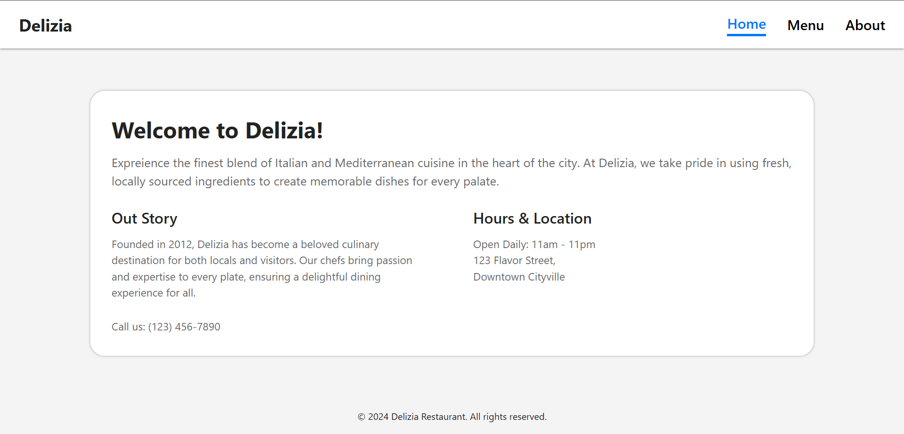

# Restaurant Page

A simple restaurant homepage built with JavaScript modules and Webpack as part of [The Odin Project](https://www.theodinproject.com/) curriculum.

## Preview



**Live Demo**: [https://wrzdx.github.io/Restaurant/](https://wrzdx.github.io/Restaurant/)

## Features
- Tabbed navigation (Home, Menu, Contact)
- Dynamically generated content
- Webpack bundling

## Key Concepts
✅ ES6 Modules  
✅ Webpack configuration  
✅ DOM manipulation  
✅ Tabbed interface pattern  


## How to Run
1. Clone the repository:
```bash
git clone https://github.com/wrzdx/Restaurant.git
```
2. Install dependencies:
```bash
npm install
```
3. Start development server:
```bash
npm run start
```
4. Open `http://localhost:8080` in your browser

---

*Part of The Odin Project's [JavaScript Course](https://www.theodinproject.com/lessons/node-path-javascript-restaurant-page)*  
*Focuses on Webpack and JavaScript modules*
